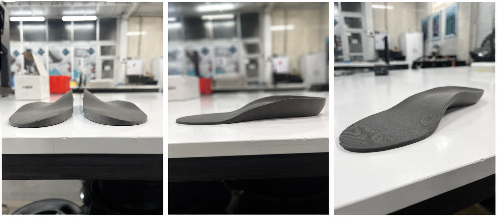
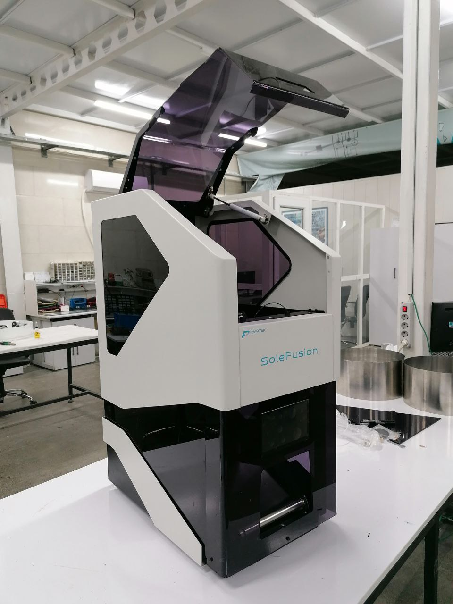

# Medical Insole 3D Printing System

## Overview

Custom 3D printing workflow developed for the production of orthopedic and medical insoles.

The project involved software customization, device testing, quality control, customer support, and production coordination activities.

---

## Responsibilities

### Software Engineering

- Customized printer control G-code
- Optimized printing workflows
- Supported production requirements

### Testing & Quality Control

- Tested completed devices
- Performed quality assurance procedures
- Verified device reliability and print accuracy
- Assisted in troubleshooting activities

### Customer Support

- Provided technical support
- Assisted customers with installation and operation
- Delivered user training and guidance

### Production Coordination

- Coordinated device preparation schedules
- Managed delivery timelines
- Collaborated with manufacturing teams

---

## Technologies

- G-code
- 3D Printing
- Manufacturing Systems
- Medical Devices
- Quality Assurance

---

## Key Features

- Custom printing workflows
- Orthopedic insole production
- Device testing and validation
- Technical support
- Production planning

---

## Application Areas

- Orthotics
- Medical manufacturing
- Custom healthcare products

---

## Project Type

Industrial Medical Device Engineering Project

*Note: Source code is not publicly available due to intellectual property and company confidentiality policies.*
